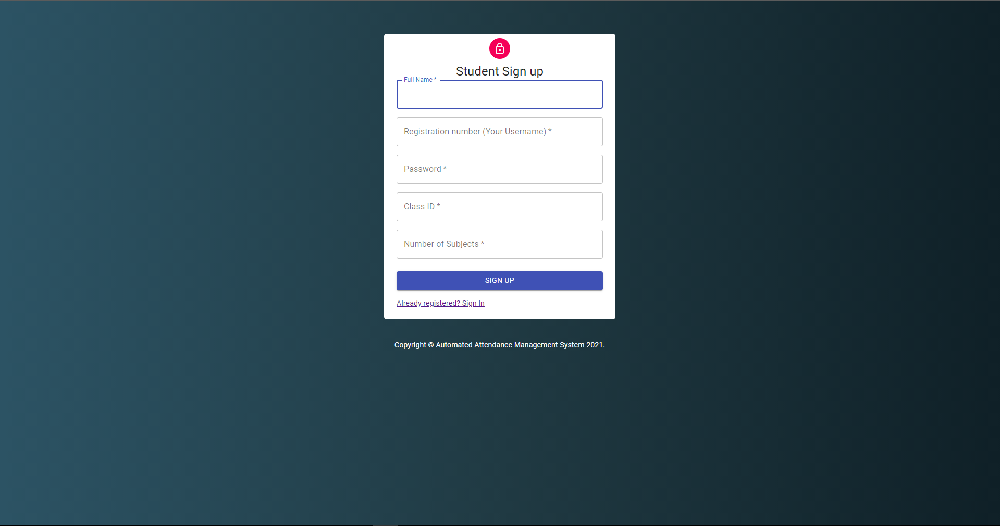
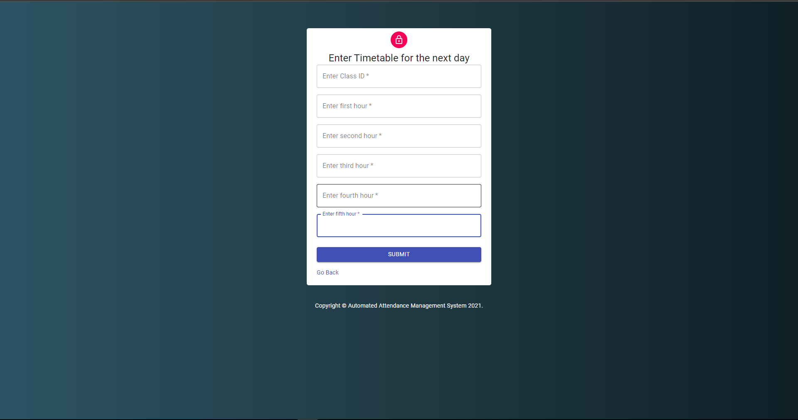

<h1 align="center">Attendance Management System with Facial Recognition</h1>
<h2 align="center">A comprehensive and lightweight attendance management system ready for deployment in the real world</h2>
<h4 align="center">The system is able to register new students along with their subjects, and is able to record a classrooms' attendance through facial recognition. The data collected is stored in a simple local MySQL database</h4>


<p align='center'>
<a href="https://github.com/srina1h/AAMSFrontend/issues">
    
</a>
<a href="https://github.com/srina1h/AAMSFrontend/blob/master/LICENSE">
    
</a>
<a href="https://github.com/srina1h/AAMSFrontend/stargazers">
    
</a>
</p>

<table>
<tr>
<td>
• Uses React for the front end <br>
• Uses an Express server along with MySQL database for the backend. The facial recognition takes place in the backend<br>
• Uses tfjs and face-api.js for facial recognition 
</td>
</tr>
</table>

<h3 align="center"><a href="https://github.com/srina1h/AAMSFrontend/blob/master/Documentation/SRS_document.pdf">Documentation for comprehensive description</a></h3>

### Done as a part of the the UCS-1617-Mini-project course at SSN College of Engineering

<h3 align='center'>
<a href="https://github.com/srina1h/AAMSBackend">
    Please clone the server backend repository from here before proceeding with the instructions
</a>
</h3>

## How to run on local system
#### Clone the repository (or download zip from release)
```bash
git clone https://github.com/srina1h/AAMSFrontend
```
#### move to folder and Install dependencies 
```bash
cd AAMSFrontend
npm install
```
#### Start the front end
```bash
npm start
```

## How to run the server backend on local system
#### Clone backend repository
```bash
git clone https://github.com/srina1h/AAMSBackend
```
#### move to folder and install dependencies
```bash
cd AAMSBackend
npm install
```
#### create folders to store images
```bash
mkdir images
mkdir student_images
```
#### In student_image folder you need to either create a folder for each roll number and upload 2 images of student (or) register through the sign up portal on the front end which creates a new folder and uploads 2 pictures taken of the student from the browser
##### To upload manually
```bash
cd student_images
mkdir roll_no_example
```
##### ^ upload 2 images to this folder named 1.jpg and 2.jpg respectively

#### Now you need to create the SQL tables from the backend, refer to backend repository

<h2 align = "center"> Some screenshots from the app</h2>
<h4 align = "center">Home</h4>
<p align="center"></p>
<h4 align = "center">Student login</h4>
<p align="center"></p>
<h4 align = "center">Student sign up</h4>
<p align="center"></p>
<h4 align = "center">Attenance portal</h4>
<p align="center"></p>
<h4 align = "center">Admin home</h4>
<p align="center"></p>
<h4 align = "center">Student data</h4>
<p align="center"></p>
<h4 align = "center">Teacher data</h4>
<p align="center"></p>
 <h4 align = "center">Updating next day timetable</h4>
<p align="center"></p>

#### This project uses the GPL-3.0 Licenese, please refer to LICENSE.md to know more
